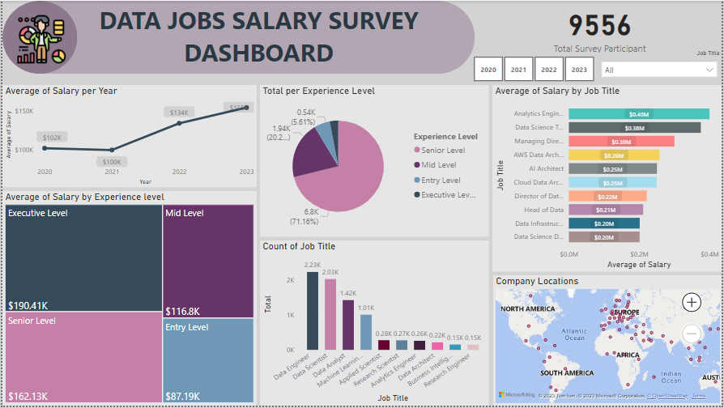

# Data Job Salary Report

## Table of Content 
- [Project Overview](#project-overview)
- [Data Sources](#data-sources)
- [Result](#result)

## Project Overview
This project is about analyzing salaries for jobs in the data field. The purpose of the analysis is to find out information about salaries, average salaries according to experience level, and types of work in the data field that have the most interest among surveyors.



## Data Sources
The data source used in this project is "salaries.csv" which contains detailed information to be used in the analysis.
 - [Download Data File Source](https://github.com/HilmaSabela/Data_Jobs_Salary/blob/main/salaries.csv)

## Tool
1. SQL --> Cleaning and Transforming Data 
2. Power BI --> Analyzing and Visualizing Data

Here are some interesting codes/features worked with in SQL :
``` sql
SELECT work_year
	,CASE
		WHEN experience_level = 'SE' THEN 'Senior Level'
		WHEN experience_level = 'MI' THEN 'Mid Level'
		WHEN experience_level = 'EX' THEN 'Executive Level'
		WHEN experience_level = 'EN' THEN 'Entry Level'
		ELSE experience_level
	END AS experience_levels
	,CASE 
		WHEN employment_type = 'FT' THEN 'Full-Time'
		WHEN employment_type = 'CT' THEN 'Casual-Time'
		WHEN employment_type = 'PT' THEN 'Part-Time'
		WHEN employment_type = 'FL' THEN 'Freelancer'
		ELSE employment_type
	END AS employment_types
	,job_title
	,salary
	,salary_currency
	,salary_in_usd
	,employee_residence
	,remote_ratio
	,company_location
	,CASE
		WHEN company_size = 'S' THEN 'Small'
		WHEN company_size = 'M' THEN 'Medium'
		WHEN company_size = 'L' THEN 'Large'
		ELSE company_size
	END AS company_sizes
FROM salaries
```

### The steps of analyzing data
In this phase, there are some steps that I do to analyze the data:
1. Transforming Data
--> Cleaning the data by changing the writing format in several columns to make it easy to understand. 
2. Analyzing Data 
--> Analyzing data using Power BI software to answer some key questions such as:
- What is the salary trend from 2020 to 2023?
- What experience level has the highest average salary?
- What types of jobs fill the survey the most?

## Results / Findings
From the results of the analysis using Power BI software, summarize the following results:
1. Salaries in the data field from 2020 - 2021 have decreased, but from 2021 - 2023 they have increased significantly. This shows that jobs in the data field are in high demand. 
2. The experience level with the highest average salary is the executive level with an average salary of more than 190K US dollars per year.
3. People who work as Data engineers are the most survey takers. 
